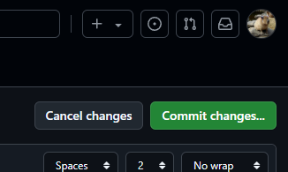
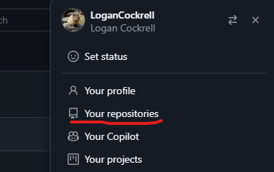
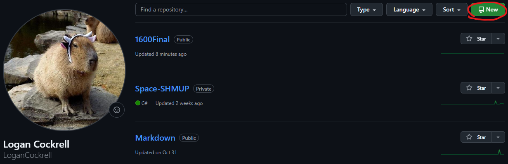
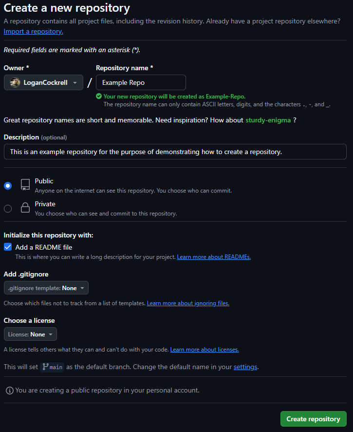
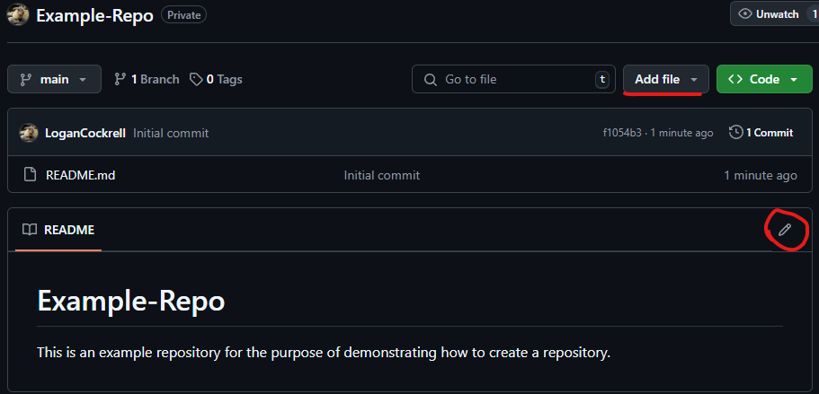

# Making a GitHub Repository

> You will need to be signed into a GitHub account in order to create a repository, if you do not already have an account you will need to make one.

[Return to Homepage](README.md)

---

### Step 1
Click your profile icon in the top left corner of the page.

---

### Step 2
Click "Your repositories".

---

### Step 3
Click the green "New" button to the right of the search bar.

---

### Step 4
- Give your repository a name! You can also add a description if you would like to. 
- Here you can also choose if you want to your repository to be public or private, private means that only you and those you give access to can view the repository. 
- You can also choose to start with a README.md file, this allows to you provide more description for your repository and use Markdown since it is a Markdown file.
Once you have entered the details you want, click the green "Create repository" button in the bottom right corner.

---

### Step 5
Congrats! You now have a repository. You can edit the README.md file if you made one by clicking the highlighted pencil button, or upload existing files with the "Add file" drop-down.

If you want to add Markdown elements to your new repo, check out the [Basic Markdown Syntax](markdownsyntax.md) page next.

